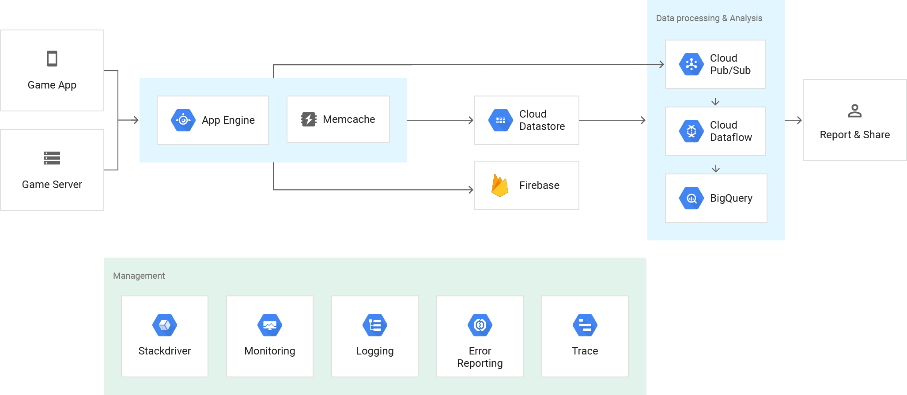

# Google App Engine
Build highly scalable applications on a fully managed serverless platform

[Full docs here](https://cloud.google.com/appengine/)

## Fully managed serverless platform
* Build and deploy applications on a serverless platform.
* Seamlessly scale from 0 to planet scale.
* Supports popular developer languages.

## Open and familiar languages and tools.
* Pre set Languages:
    * Java
    * PHP
    * Java
    * Node.js
    * C#
    * Ruby
    * GO
    * Add more languages runtimes and frameworks.

## Just add code.
* Fully managed scalability, scale from zero to planet scale without any configuration required.
* Protect app from security threats by using:
    * App Engine firewall
    * IAM rules
    * SSL/TLS Certs

## Pay for what you use
* Only pay for used recourses

## Features
### Popular languages
Build your application in Node.js, Java, Ruby, C#, Go, Python, or PHP—or bring your own language runtime.

### Open and flexible
Custom runtimes allow you to bring any library and framework to App Engine by supplying a Docker container.

### Fully managed
A fully managed environment lets you focus on code while App Engine manages infrastructure concerns.

### Monitoring, logging, and diagnostics
Google Stackdriver gives you powerful application diagnostics to debug and monitor the health and performance of your app.

### Application versioning
Easily host different versions of your app, easily create development, test, staging, and production environments.

### Traffic splitting
Route incoming requests to different app versions, A/B test, and do incremental feature rollouts.

### Application security
Help safeguard your application by defining access rules with App Engine firewall and leverage managed SSL/TLS certificates* by default on your custom domain at no additional cost.

### Services ecosystem
Tap a growing ecosystem of GCP services from your app including an excellent suite of cloud developer tools.

## Solutions and Use Cases
### Modern Web Applications
Quickly reach customers and end users by deploying web apps on App Engine. With zero-config deployments and zero server management, App Engine allows you to focus on writing code. Plus, App Engine automatically scales to support sudden traffic spikes without provisioning, patching, or monitoring.

Below is a sample reference architecture for building a simple web app using App Engine and Google Cloud Platform.

### Scalable mobile backends
Whether you’re building your first mobile app or looking to reach existing users via a mobile experience, App Engine automatically scales the hosting environment for you. Plus, seamless integration with Firebase provides an easy-to-use frontend mobile platform along with the scalable and reliable backend.

Below is a sample reference architecture for a typical mobile app built using both Firebase and App Engine along with other services in Google Cloud Platform.

