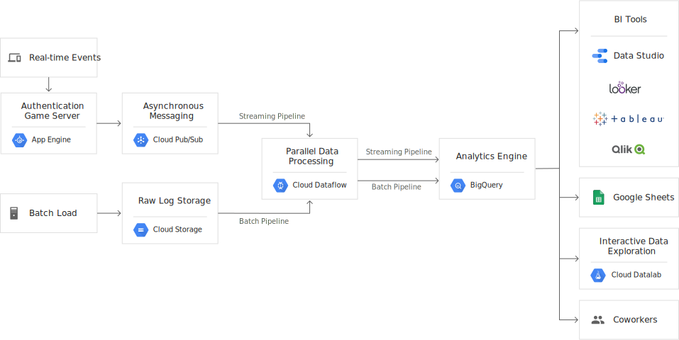

# Big Query
BigQuery is a serverless, highly-scalable, and cost-effective cloud data warehouse with an in-memory BI Engine and machine learning built in.

[Full docs here](https://cloud.google.com/bigquery/)

* Highly scalable data warehouse
* Runs SQL against tera or even petabytes of data
* Separates storage and compute to enable elastic scaling
* Parallel execution and computation means that multiple users have access to the [data lake](./cloud_storage_data_lake.md) regardless of the number of users or size of the data.
* Create reports with built in [BI Engine](./bi_engine.md)
* ANSI-compliant SQL
* Both ODBC and JDBC drivers 
* Automatic data replication
* 99.9% uptime

## Features
### Serverless
Big Query is completely managed by Google

### Real-time analysis
Analyse data as it gets added

### Automatic high availability
Replicates storage into multiple location for ease of retrieval

### Standard SQL
ANSI:2011 compliant SQL

### Federated query and logical data warehousing
Through powerful federated query, BigQuery can process external data sources in object storage (Cloud Storage), transactional databases (Cloud Bigtable), or spreadsheets in Drive — all without duplicating data.

### Storage and Compute separation 
Making it a lot cheaper to horizontally scale.

### Automatic backup and easy to restore.
.

### Geospatial data types and functions
Brings SQL support for arbitrary points, lines, polygons and multi-polygons.

### Big data ecosystem integration
Integrates with Cloud DataProc, DataFlow as well as with the Apache Big Data ecosystem.

### Flexible pricing models
Pay for the storage and compute that is used.

### Data governance and security
Maintain strong security with granular [Cloud Identity and Access Management](./access_control.md). Data is also encrypted at rest and in transit.

### Geoexpansion
BigQuery gives you the option of geographic data control (in US, Asia, and European locations), without the headaches of setting up and managing clusters and other computing resources in region.

### Foundation for AI
Besides bringing ML to your data with BigQuery ML, integrations with Cloud ML Engine and TensorFlow enable you to train powerful models on structured data in minutes with just SQL.

### Foundation for BI
BigQuery forms the data warehousing backbone for modern BI solutions and enables seamless data integration, transformation, analysis, visualization, and reporting with tools from Google and our technology partners.

### Flexible data ingestion
Load data from GCS, or load thousands of rows per second from different dbs

### Programmatic interaction
REST API for easy integration into your service. 
Supported languages:
* Java
* Python
* Node.Js
* C#
* GO
* RUBY
* PHP (Don't use this one)

### Rich monitoring and logging with Stackdriver
Rich monitoring through [Stackdriver](../logging/audit_logs.md)

## Key Features
### Big Query ML
* Build, test, and operationalize custom machine learning models using familiar SQL language
* Build ML models in BigQUery without extensive data sampling.
* Drive product recommendations, segmentations, and predictions at petabyte scale and at a fraction of the cost

## Data Warehousing solution architecture 

