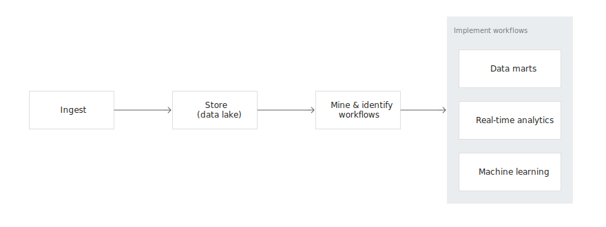

# Cloud Storage as a Data Lake

[Full docs here](https://cloud.google.com/solutions/build-a-data-lake-on-gcp)

* Separate storage and compute.
* Data Warehose vs Data LAke
    * Data warehouse has rigid schemas, while a data lake is more of a 'save all approach'

## Cloud storage as a Data Lake
### Performance and durability
* Supports high volume ingestion
* Integrates with Pub/Sub
* Durable - GCS has an up time of 99.999999999%

