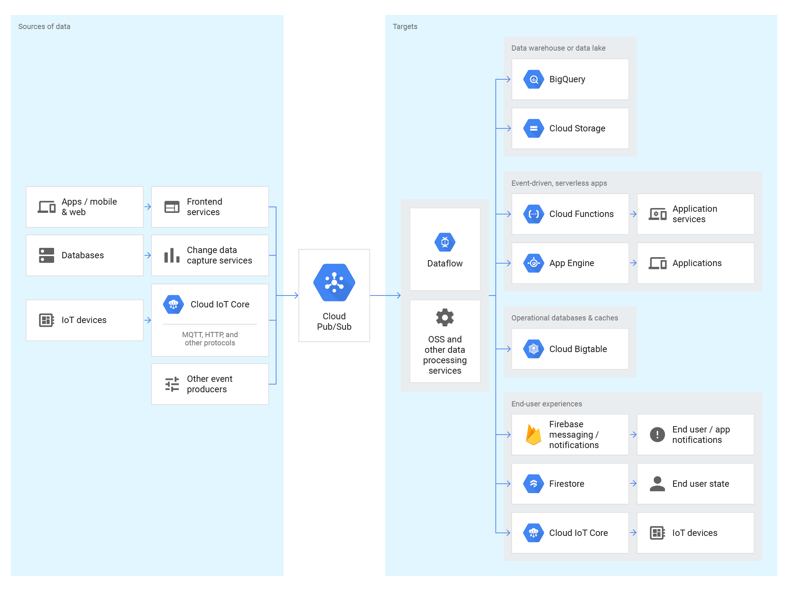

# Cloud Pub/Sub
Global messaging and event ingestion made simple.

[Full docs here]

* Scale without provisioning, partitioning, or load isolation worries
* Expand your applications and pipelines to new regions simply with global topics
* Enrich, deduplicate, order, aggregate, and land events using [Cloud Dataflow](../data_flow/data_flow.md)
* Mix real-time and batch processing via Cloud Pub/Sub’s durable storage
* Push subscriptions deliver the event to serverless apps running in Cloud Functions, [App Engine](../../app_engine/app_engine.md) or [Cloud Run](../../cloud_run/cloud_run.md)
* Pull subscriptions make it available to more complex stateful services running in [Google Kubernetes Engine](../../compute_engine/kubernetes_engine.md) or [Cloud Dataflow](../data_flow/data_flow.md)
* Multi-region environments operate seamlessly because of Cloud Pub/Sub’s global nature
* End-to-end encryption, IAM, and audit logging
* NoOps, fully automated scaling and provisioning with virtually unlimited throughput
* Extreme data durability and availability with synchronous cross-zone replication
* Native client libraries in major languages and an open-service API

## Cloud Pub/Sub for global messaging and event ingestion

## Features
* All messages will be delivered at least once.
* No partitioning, just set the quota, publish and consume.
* Easily integrated with http apis, Gmail and many GCP products.
* Open REST api and client libraries in several languages.
* No replication needed to keep latency down.
* Cloud Pub/Sub is a HIPAA-compliant service, offering fine-grained access controls and end-to-end encryption.
* Can re run messages easily.

## Notes from questions
* Default retention time is 7 days
* Max retention is 7 days
* Min retention is 10 min

