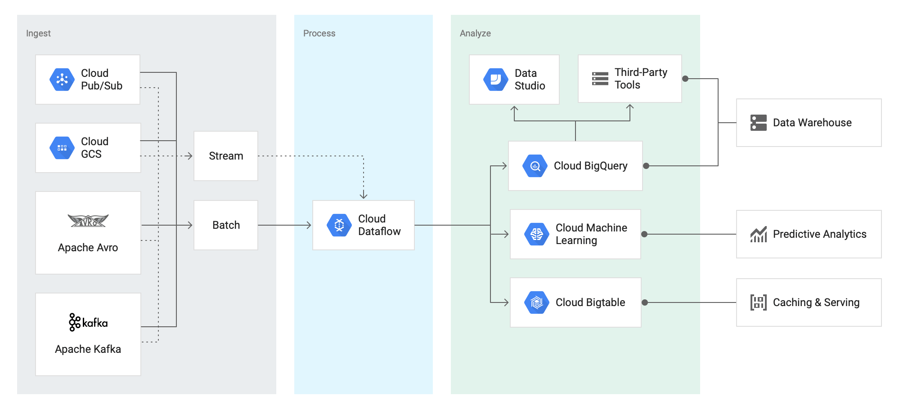
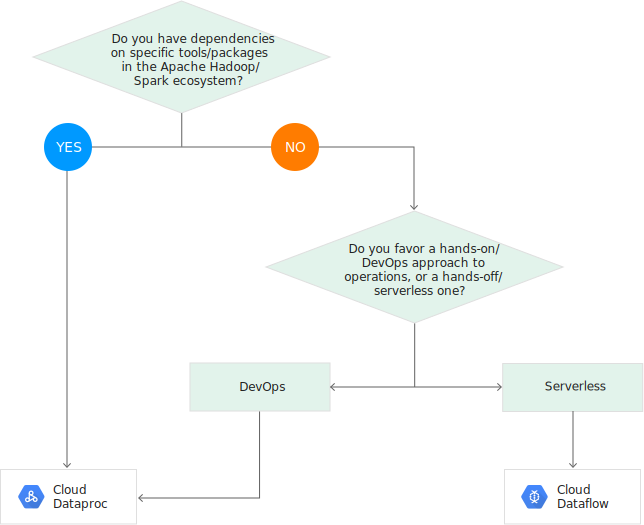

# Cloud Data FLow
Simplified stream and batch data processing, with equal reliability and expressiveness

[Full docs here](https://cloud.google.com/dataflow/)

* Fully managed
* Service to enrich:
    * Streamed (real time) data
    * Batch (historical) data
* SQL, Java and Python API's using [Apache Beam APK](https://beam.apache.org/)
* Integrates with Stackdriver for loggin.
* Integrate ML into the processing easily 
* Can choose different execution engines:
    * Apache spark via Cloud Dataproc

## Data Transformation with Cloud Dataflow

## Features

### Automated Resource management
Automates the provisioning of processing resources to minimize latency.

### Dynamic work Rebalancing
Automatically load balances lagging data processes.

### Reliable & Consistent Exactly-once Processing
Provides built-in support for fault-tolerant execution that is consistent and correct regardless of data size, cluster size, processing pattern or pipeline complexity.

### Horizontal Auto Scaling
Scaling horizontal automatically by adding workers.

### Unified Programming Model
Apache Beam SDK offers equally rich MapReduce-like operations, powerful data windowing, and fine-grained correctness control for streaming and batch data alike.

### Community-driven Innovation
Developers wishing to extend the Cloud Dataflow programming model can fork and/or contribute to Apache Beam.

### Flexible resource scheduling pricing for batch processing
For processing with flexibility in job scheduling time, such as overnight jobs, flexible resource scheduling offers a lower price for batch processing. These flexible jobs are placed into a queue with a guarantee that they will be retrieved for execution within a six-hour window.

## Cloud Dataflow vs. Cloud Dataproc: Which should you use?

Dataproc and Dataflow are very similar in a lot of ways. So which should you use?

|Cloud Dataproc|Cloud Dataflow|
|--------------|--------------|
|Best for environments that use specific apache components|Typically the preferred options for greenfield environments|
|Tools/Packages|Less operation overhead|
|Pipelines|Unified approach to development of batch or streaming pipelines|
|Skill sets of existing resources|Uses Apache Beam|
||Supports pipeline portability across CLoud Dataflow, Apache Spark, and Apache Flink as runtimes|

## Recommended workloads
|Workloads|Cloud Dataproc|Cloud Dataflow|
|---------|--------------|--------------|
|Stream Processing(ETL)||X|
|Batch Processing(ETL)|X|X|
|Iterative Processing and notebooks|X||
|Machine learning with Spark ML|X||
|Pre-processing for ML||X (With Cloud ML engine)|
