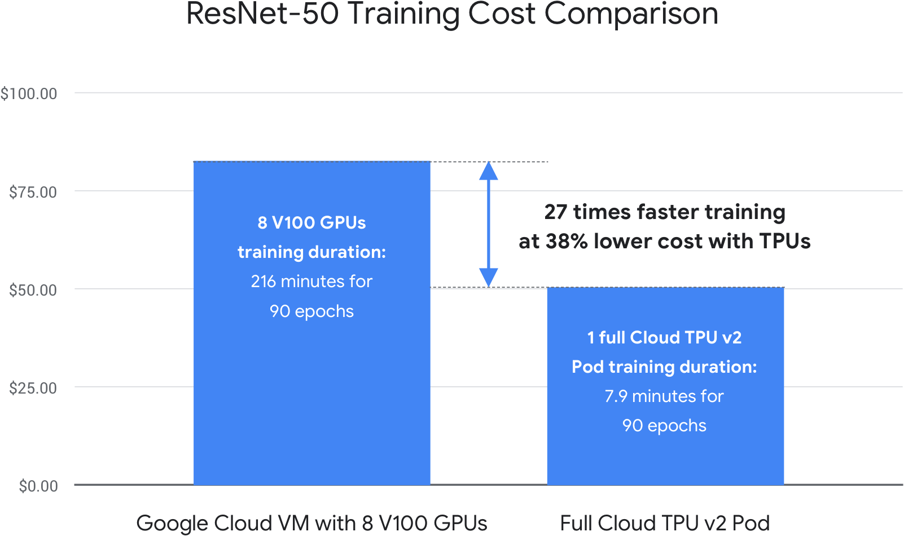

# Cloud TPU
[full docs here](https://cloud.google.com/tpu/)

## Empowering businesses with Google Cloud AI

Cloud TPU is the custom-designed machine learning ASIC that powers Google products like Translate, Photos, Search, Assistant, and Gmail

## Benefits
* Built for AI
* Network speed over 100 petaflops of performance in single pod
* Ideal for machine learning teams iterating over large datasets

## Cloud TPU Offering
* Cloud TPU V2:
    * 180 Teraflops
    * 64 GB High Bandwidth Memory (HBM)
* Cloud TPU V3:
    * 420 Terraflops
    * 128 GB HBM
* Cloud TPU V2 pod (BETA):
    * 11.5 petaflops
    * 4 TB HBM
    * 2-D Toroidial mesh network
* Cloud TPU v3 pod (BETA):
    * 100+ Terraflops
    * 32 TB HBM
    * 2-D Torodial mesh network

## Cloud TPU fatures
* [Library of optimised models](https://github.com/tensorflow/tpu/tree/master/models/official)
* Connect Cloud TPUs to custom machine types
* [Preemptible](preemtible.md) Cloud TPU