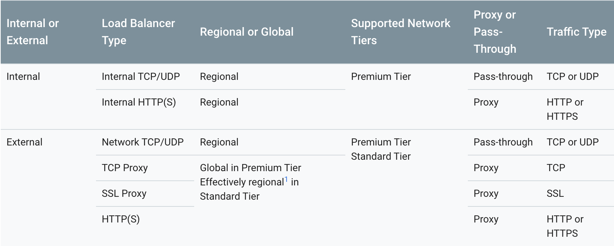
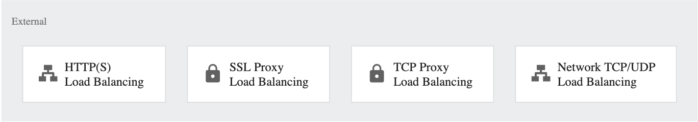
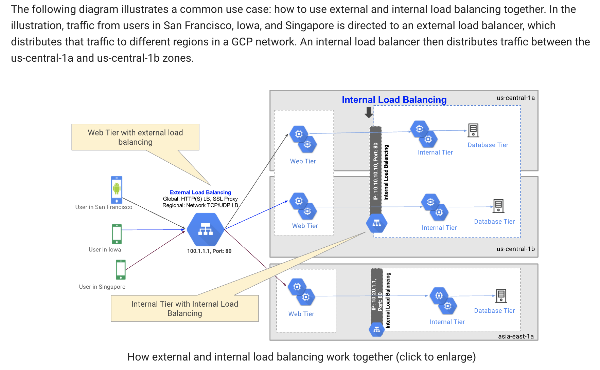

# Overview of Load Balancing

[Full docs here](https://cloud.google.com/load-balancing/docs/load-balancing-overview)

* Distribute load balanced compute recourses across multiple regions through a single anycast IP address.
* Uses auto scaling.
* Fully integrated with Cloud CDN
* Content is served closer to the end user.

## Types of Cloud Load Balancing.

### Global vs Regional load balancing.
* Global Load Balancing:
    * When backends are distributed across multiple regions.
    * Single anycast IP address.
    * IPV6 Termination
* Regional Load Balancing:
    * when your backends are in one region,
    * you only require IPv4 termination.

### External vs Internal 
* External Load balancers:
    * Use external load balancing when you need to distribute traffic from the Internet to a GCP network.
    * GCP external load balancing offers the following:
        * HTTP or HTTPS traffic: global HTTP(S) Load Balancing
        * TCP traffic with SSL offload: global SSL Proxy Load Balancing
        * TCP traffic without SSL offload: global TCP Proxy Load Balancing
        * UDP traffic: regional Network TCP/UDP Load Balancing
        * IPv4 or IPv6 clients
        * Global or regional load balancing
    * Global load balancing requires that you use the Premium Tier of Network Service Tiers. For regional load balancing, you can use Standard Tier.

* Internal Load balancers:
    * Use internal load balancing when you need to distribute traffic to instances within a GCP network.

    * GCP Internal TCP/UDP Load Balancing offers the following:
        * TCP or UDP traffic
        * RFC 1918 load balancing
        * Client IP address is preserved
        * Health checks
        * Autoscaling without prewarming
        * Session affinity
        * Regional load balancing
    * GCP Internal HTTP(S) Load Balancing (Beta) offers the following:
        * HTTP(S) traffic
        * RFC 1918 load balancing
        * Health checks
        * Autoscaling without prewarming
        * Session affinity
        * Regional load balancing
* Traffic type
    * The type of traffic is another consideration before choosing a load balancer:
        * HTTP and HTTPS traffic can be handled by external HTTP(S) or Internal HTTP(S) Load Balancing.
        * TCP traffic can be handled by Network Load Balancing or Internal TCP/UDP Load Balancing.
        * UDP traffic can be handled by Network Load Balancing or Internal TCP/UDP Load Balancing.

  

## Vocab
* target pool: A target pool is a single access point that all of the instances can be connected to through.
