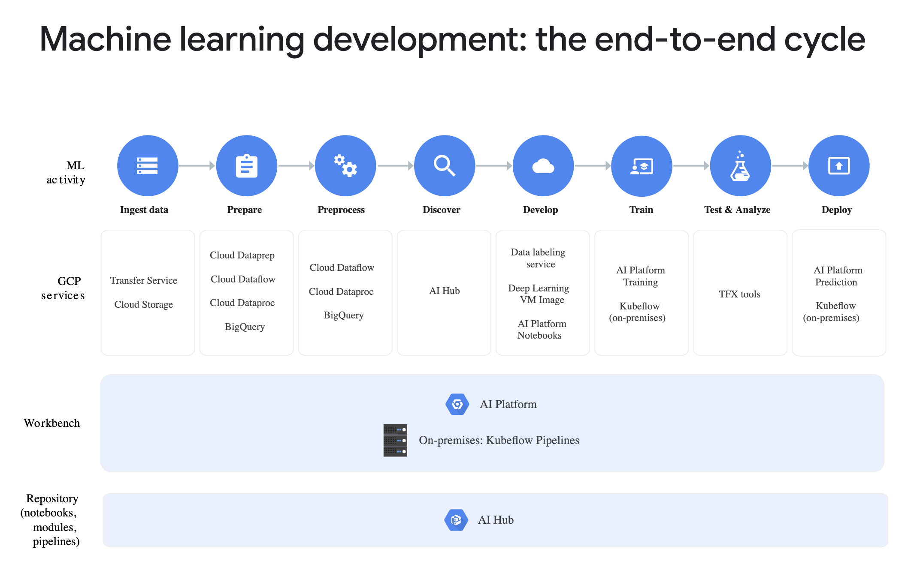

# AI Platform

[Full docs here](https://cloud.google.com/ml-engine/)

Create your AI applications once, then run them easily both in cloud and on premise.

## Take your machine learning products to production
* From data engineering to "no-lock" flexibility
* Integrated toolchain helps to run your own ML applications.
* Supports Kubeflow:
    * Googles open-source platform
    * Build portable ML applications
    * Run in cloud or on premises
* access to cutting-edge Google AI technology like TensorFlow, TPUs, and TFX tools as you deploy your AI applications to production.

### Prepare
* Built in data labelling service.
* Import labeled data to AutoML and directly train the model.

### Build and run
* Build applications on GCP using a fully managed notebook.
    * Provides fully configured environments for ML frameworks using [Deep learning VM image](https://cloud.google.com/deep-learning-vm)
* Build and train models on gcp
* Deploy to productioin:
    * To GCP serverless.
    * To on premise servers using the training and prediction microservices provided by Kubeflow.

### Manage
* Manage your models, experiments and end-to-end workflows using the console on GCP
    * or on premise using Kubeflow pipelines.
* Advanced tools to help understand model results.

### Share
You can discover ML pipelines, notebooks, and other AI content via AI Hub and leverage Kubeflow Pipelines to build reusable end-to-end ML pipelines that you can share with other users and deploy on GCP or on-premises.

