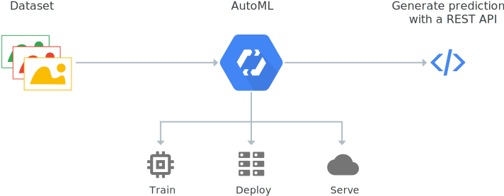

# Cloud AutoML BETA
Train high-quality custom machine learning models with minimal effort and machine learning expertise.

## Train custom machine learning models.
* Suite of ML products to help devs with limited ml experience build high quality models.

## State of the art performance.
Cloud AutoML leverages more than 10 years of proprietary Google Research technology to help your machine learning models achieve faster performance and more accurate predictions.

## Get up and running fast
* Simple GUI
* train, evaluate, improve, and deploy models based on your data.

## Generate high-quality training data
* Google’s human labeling service can put a team of people.
    * Annotating data
    * Cleaning data
    * Make sure models are being trained on high quality data.

## AutoML products
Create your own custom machine learning models with an easy-to-use graphical interface.

### Sight
[AutoML Vision](https://cloud.google.com/vision/automl/docs/)

[AutoML Video Intelligence](https://cloud.google.com/video-intelligence/automl/docs/)

### Language
[AutoML Natural Language](https://cloud.google.com/natural-language/automl/docs/)

[AutoML Translation](https://cloud.google.com/translate/automl/docs/)

### Structured Data
[AutoMl Tables](https://cloud.google.com/automl-tables/docs/)

## How AutoML works

## Cloud AutoML Features.
### Custom models.
* Trains custom ML models. 
* Minimum effort or ML expertise.

### Powered by Google’s AutoML and transfer learning
Leverages Google state-of-the-art AutoML and transfer learning technology to produce high-quality models.

### Fully integrated
Cloud AutoML is fully integrated with other Google Cloud services, giving you a consistent way to access the entire Google Cloud service line, including storing your training data in Cloud Storage. To generate a prediction on your trained model, simply use the existing Vision API by adding a parameter for your custom model or use Cloud ML Engine’s online prediction service.

## Integration with data labeling service.
If you have images but no labels yet, an in-house Google team will review your custom instructions and classify your images accordingly. You’ll get high-quality training data while your data remains private. You can also use the human-labeled data seamlessly to train a custom model. Available for AutoML Vision only.

