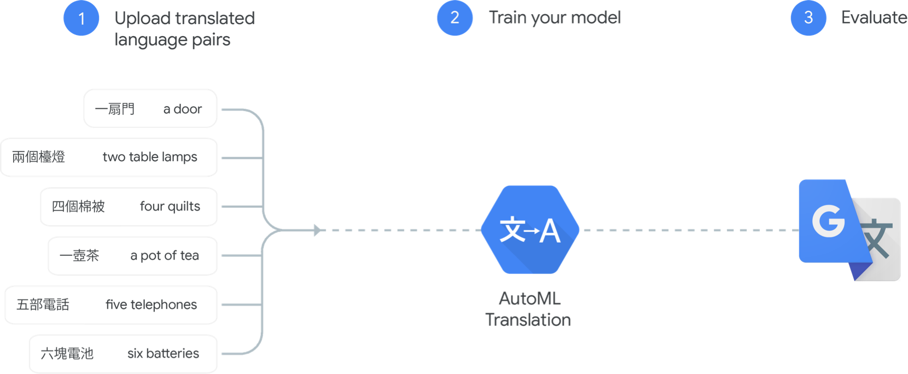
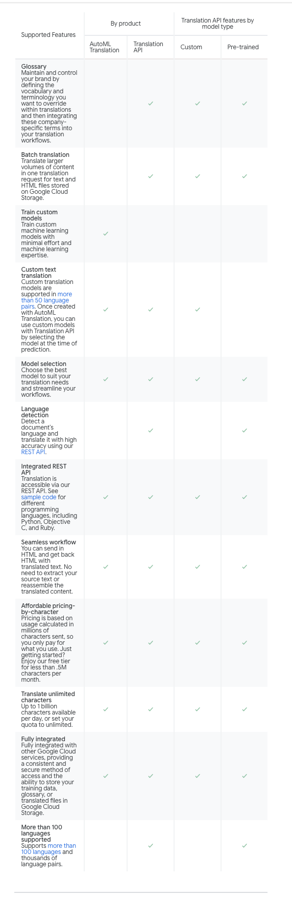

# Translation
Dynamically translate between languages using Google machine learning

[Full docs here](https://cloud.google.com/translate/)

## Fast dynamic translation
* Translate dynamically between languages

## AutoML
* Limited ML skill can still make high quality models.
* Custom models built using Language pairs

## TranslationAPI
* Translate into over one hundred languages
* Can use custom language models.

## How AutoML Translation works

## Benefits
### Translate many languages
Supports more than 100 languages

### Language detection
Auto identify language

### Glossary report

### Highly scalable

### Easy integration
Using the REST api means that it's easy to integrate into any workflow

### Simple affordable pricing
Charges on per char basis.

## Which product should you use?

