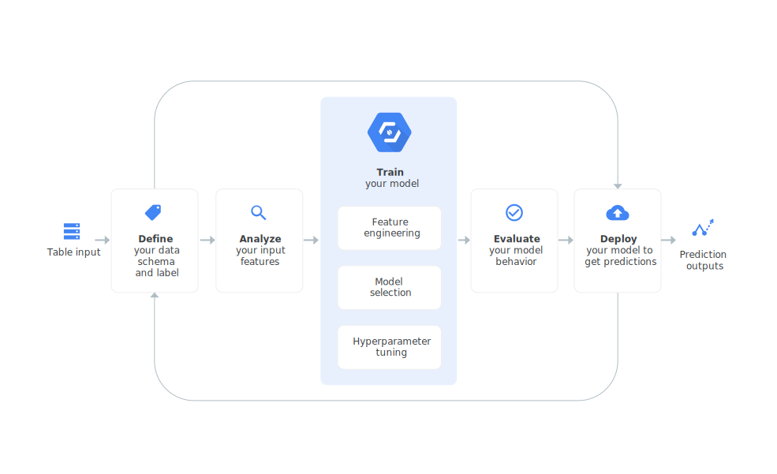
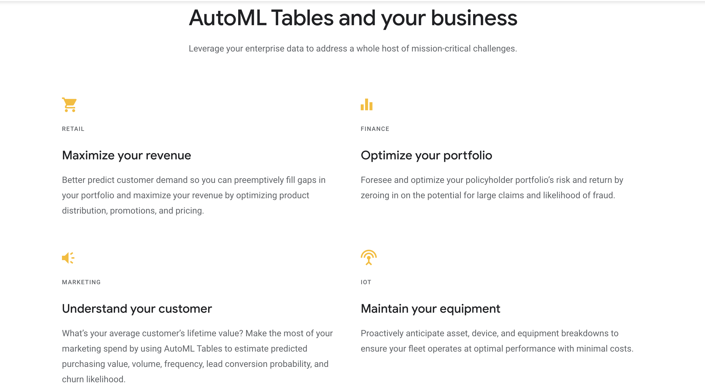

# AutoML Tables BETA
Automatically build and deploy state-of-the-art machine learning models on structured data.

[Full docs here](https://cloud.google.com/automl-tables/)

## ML on structured data at speed and scale.
* Build ML models at speed and scale.

## Increase model quality.
* Auto search through Googles model zoo to find the model with the best fit.
* Models range from linear/logistic regression for simpler datasets. To advanced deep, ensemble, and architecture-search methods for larger, more complex ones.

## Handles data as found in the wild
* AutoML Tables automates feature engineering on a wide range of tabular data primitives — such as numbers, classes, strings, timestamps, and lists.
* Helps take care of missing values, outliers and other data issues.

## Easy to build models.
Our codeless interface guides users through the full end-to-end machine learning lifecycle, making it easy for anyone on your team to build models and reliably incorporate them into broader applications. We provide extensive input data and model behavior explainability features, along with guardrails to prevent common mistakes. AutoML Tables is also available in API and notebook environments.

## Easy to deploy and scale.
* Uses Googles low latency server structure.
* Makes deploying machine learning models extremely easy, regardless of production workload volume and global reach.

## Saves time
AutoML Tables reduces the time it takes to go from raw data to top-quality, production-ready machine learning models from months to just a few days.

## Saves money
AutoML Tables doesn’t require a large annual licensing fee. It’s priced based on compute and memory usage, so you’ll only get charged for what you actually use.

## How AutoML Tables works.

  

## AutoML Tables and your business
