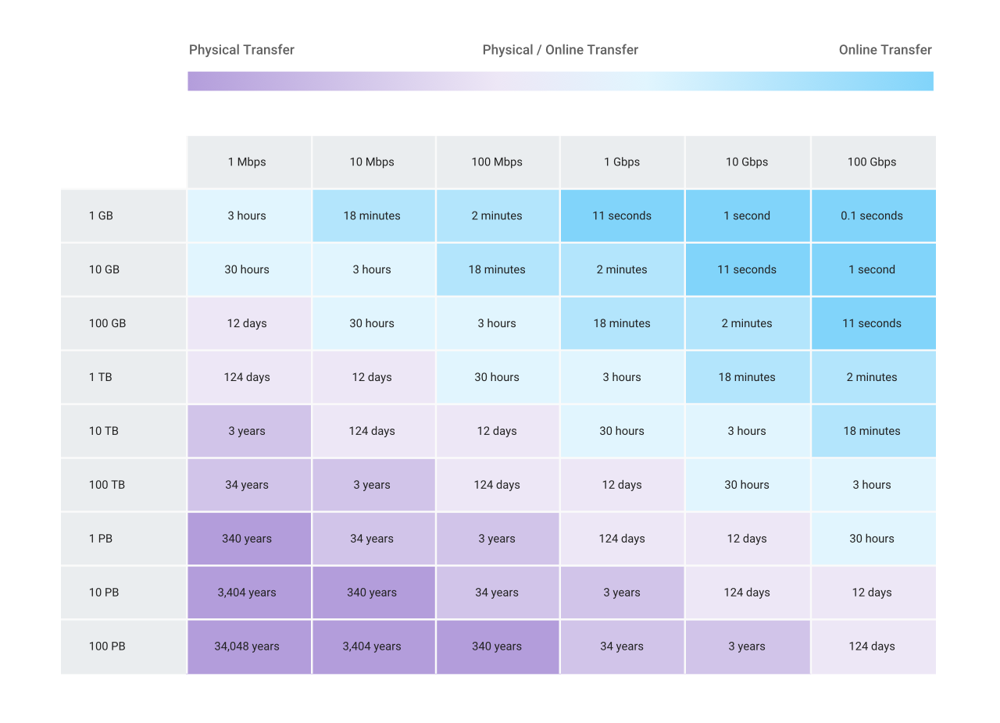

# Cloud Data Transfer

Move your data to Google Cloud Platform fast

[Full docs here](https://cloud.google.com/products/data-transfer/)

## Online Transfer
Use your network to move data to Google Cloud Storage.

## Cloud Data Transfer Service
* "Data Sink" = The Google Cloud bucket
* Use transfer service to:
    * Move or back up to cloud storage.
    * Move data from one bucket to another
    * Periodically move data between buckets
* Schedule transfers.

## Transfer Appliance
* Ship data to Google upload facility
    * They upload for you
* Where is transfer appliance available:
    * United States
    * Canada
    * EU
    * Norway
    * Switzerland

## Google BigQuery Data Transfer Service
Simplified data imports to Google BigQuery

[Full docs here ](https://cloud.google.com/bigquery/transfer/)

* Automates data movement from SaaS to BigQuery
* Can collect data from Amazon S3
* Uptime SLA means very little downtime 
* Always up to date
* Features:
    * Simple setup.
    * Automatic updates
    * Can connect to Teradata and Amazon S3

## Use Cases
* Data Center migration
* Decommission Tape Libraries and Infrastructure
    * Easily transfer from tape to GCS
* Machine Learning
    * Once transferred to BigQuery or GCS, dataflow can run ML

## Features
### Online Transfers
* GSutil cli, drag and drop and JSON API make transfers simple
* Connect direct to applications:
    * Google Ads
    * Campaign Manager
    * Google Ad Manager
    * YouTube Content and Channel Owner Reports

### Across Clouds
* Ensures all of the transferred files are correct.
* Schedule one time or periodic transfers
* Delete files in the Data Sink if it isn't in the source

### Offline Transfer
* Capture up to a petabyte on one transfer appliance
* Data is encrypted at moment of capture and you decrypt it once it's uploaded
* Transfer Appliance can:
    * Fit into the server rack in a data center
    * Guide through data capture using a GUI

