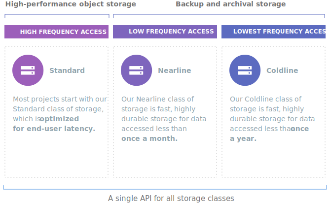
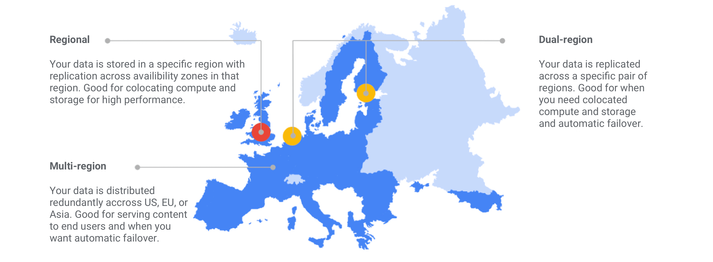

# Google Cloud Storage

Unified object storage for developers and enterprises. Integrate persistent storage across multiple platforms

## Storage solutions for any workload

## Choose location based on latency
Try to choose a location as close to your user base as possible

## Features
* Single api across multiple platforms
* Scalable to exabytes of data
* Designed for 99.9% up time
* Time to first byte is milliseconds 
* Consistent listing

